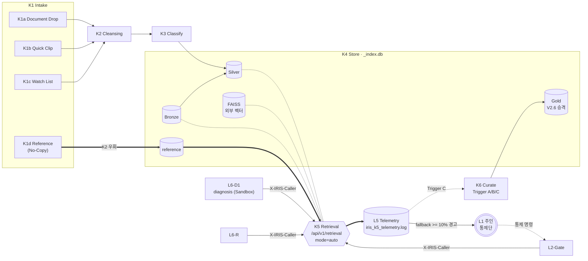
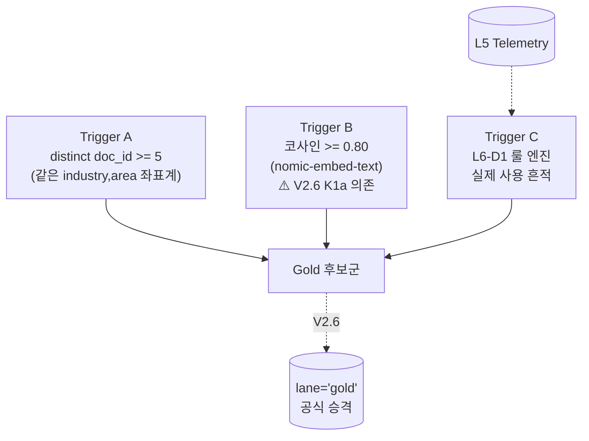
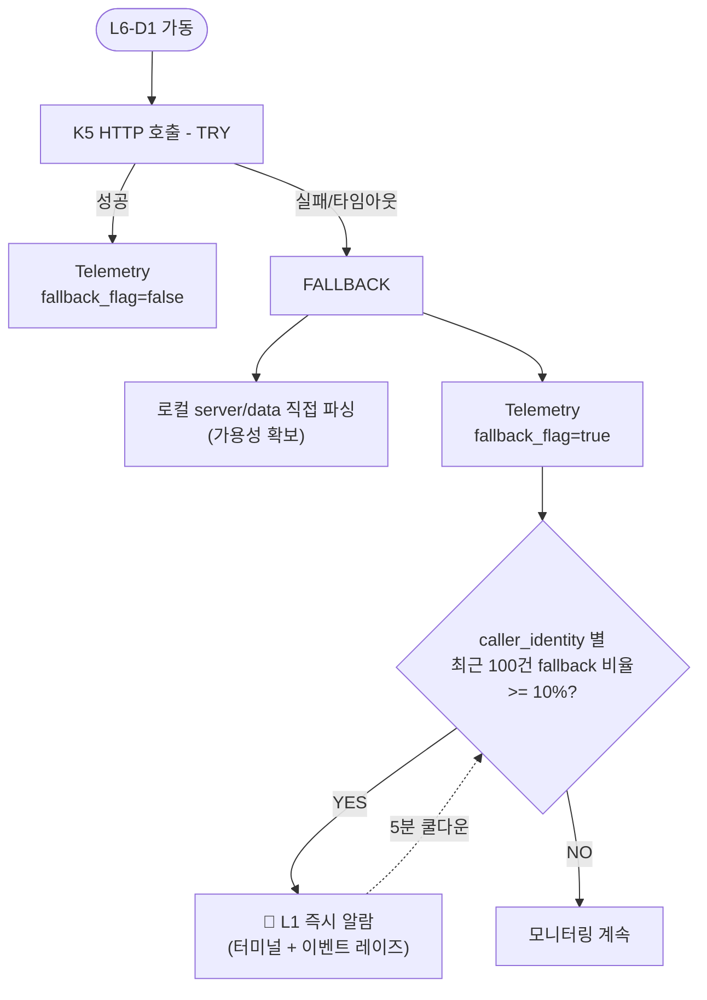

> 📌 **불변 스냅샷.** 원본: [/Volumes/0Dev/IRIS_V2.5_계층구조_2026-05-22.md](../../../../IRIS_V2.5_계층구조_2026-05-22.md). 직전: [[V2.4_2026-05-20]] · 색인: [[index]]

# IRIS V2.5 계층 구조 — 2026-05-22 기준

> **버전:** 2.5 (rev3 최종 확정본 — **단일 통합 Retrieval 엔드포인트**, **Gold 정량 트리거(A/B/C)**, **L6-D1 회복력 계약**, **`X-IRIS-Caller` 식별 규약**, **Telemetry Zero + 위장 Fallback 알람**, **V2.5 완료 기준 4개 지표**)
> **이전 버전:** [[V2.4_2026-05-20]] (K4·K5 1차 구현, K1d Reference Lane, 630 docs)
> **상태:** L4-K 지식센터 데이터 동맥경화 해소 / 결함 추적·측정 사양 완결 / 실전 가동 라이브
> **무게중심:** 주인(설계자)의 하향식 통제권 아래, 정량 수치와 호출자 식별 규약으로 *결함을 드러내는* 실질적 가치 검증

---

## V2.4 → V2.5 핵심 변경 (rev3 기준)

| # | 항목 | V2.4 (2026-05-20) | V2.5 (2026-05-22) |
|---|---|---|---|
| 1 | **K5 검색 인터페이스** | `query_matrix` + `query_fts` 분리 함수 | ✅ **단일 엔드포인트** `/api/v1/retrieval` + `mode=auto\|matrix\|fts\|semantic` 자동 라우팅 |
| 2 | **K5-③ Semantic** | 🔴 sqlite-vec 미지원으로 잠정 유예 | ✅ **Ollama 임베딩 + 로컬 FAISS 우회 결합**으로 가동 |
| 3 | **L6-D1 ↔ K5 계약** | 🟡 path-pointer 패턴만, D1 미접속 | ✅ **HTTP 우선 + Embedded Fallback** 3단 가동 (TRY → FALLBACK → `IRIS_K5_MODE=embedded`) |
| 4 | **호출자 식별** | 없음 | ✅ **`X-IRIS-Caller` 헤더 규약** (L6-D1 / L2-Gate / L6-R), 누락 시 `FAULT:anonymous` 마킹 |
| 5 | **Gold 셀 발견** | 🔴 0건 이월 (추상적 "밀도") | ✅ **3대 정량 트리거 (A/B/C) 확립** — 양식·발행은 V2.6 이월 |
| 6 | **Trigger A** | — | distinct `doc_id` ≥ 5 (단일 문서 중복은 1건 산정) |
| 7 | **Trigger B** | — | Ollama `nomic-embed-text` 코사인 ≥ 0.80 / **K1a E2E 의존, V2.5에선 0건이 정상** |
| 8 | **Trigger C** | — | L6-D1 룰 엔진의 *실제 사용 흔적* 요구 (HTTP 200만으론 부족) |
| 9 | **L5 Observability** | 없음 | ✅ **Telemetry Zero** (`iris_k5_telemetry.log`), 일자 회전 + 50MB 분할 + 14d gzip / 90d 폐기 |
| 10 | **위장 성공(Silent Failure) 방어** | — | ✅ caller별 최근 100건 윈도우 fallback 비율 ≥ 10% → **L1 즉시 알람**, 5분 쿨다운 |
| 11 | **L6 위상** | "응용단" (목적) | **'1차 검증용 Sandbox 고객'** — K5 데이터 계약을 두드려 보는 테스트베드로 강등 |
| 12 | **L1 통제권** | 분산 | ✅ 하향식 프롬프트 + L5 로그·알람 수신 → 전권 복원 |
| 13 | **V2.5 완료 기준** | — | ✅ 4개 정량 지표 명시 (정상호출 ≥ 95% / Gold 후보 ≥ 3 / 헤더누락 < 1% / 가용성 ≥ 99%) |

---

## V2.5 타겟 아키텍처 개관



---

## 1. 레이어 성격 재정의 (V2.5 의 핵심 통찰)

| 코드 | 역할 | V2.5 포지션 |
|---|---|---|
| **L1** Interface / 통제단 | 주인(설계자) 전권 제어 | 하향식 프롬프트 + L5 알람 수신 |
| **L2** Gateway / 중계단 | 통제 명령 → 컨텍스트 결합 | `[IRIS_KNOWLEDGE_CONTEXT]` 주입 |
| **L4-K** Knowledge Center | 코어 자산 | K1~K6 sub-layer 완결 |
| **L5** Observability / 감시단 | Telemetry + 알람 | 파일 append 한 줄로 *3역할* (감시 + Gold 발견 + 결함 고발) |
| **L6** Application / **검증단** | **목적 아님 — Sandbox 고객** | K5 계약을 실전 비즈니스 로직에서 *결함이 드러나도록* 두드림 |

> ⚠️ V2.5 의 성공 여부는 **D1 의 동작 여부가 아니라, D1 을 통해 K5 계약의 결함이 드러나는가**로 판단한다.

---

## 2. K5 단일 통합 Retrieval API

### 2.1 엔드포인트

```
GET /api/v1/retrieval
    ?mode=auto|matrix|fts|semantic
    &query=<text>
    &industry=<A..H>
    &area=<ch?_*>
    &level=<S|M|L|default>
    &lane=<reference|bronze|silver|gold>
    &limit=<int, default 20>
```

### 2.2 호출자 식별 헤더 (`X-IRIS-Caller`)

| 호출 주체 | 헤더 값 |
|---|---|
| L6 진단 엔진 | `X-IRIS-Caller: L6-D1` |
| L2 게이트웨이 | `X-IRIS-Caller: L2-Gate` |
| L6 보고서 생성기 | `X-IRIS-Caller: L6-R` |
| (누락) | Telemetry 에 `FAULT:anonymous` 로 마킹 |

### 2.3 자동 라우팅 휴리스틱 (`mode=auto` / 누락 시)

1. **Matrix** — `query` 비고 `(industry, area)` 완비 → 결정적 path-pointer
2. **FTS** — `query` 에 `"..."` 또는 FTS 연산자(`AND`/`OR`/`NOT`) → `documents_fts`
3. **Semantic** — 그 외 자연어 질의 → Ollama 임베딩 + FAISS L2 거리

> 비용 순(Matrix < FTS < Semantic)으로 분기. 명시 호출(`mode=fts` 등)은 휴리스틱 우회.

---

## 3. K6 — Gold 셀 정량 트리거 (V2.5 후보군 식별까지)



- **Trigger A** — 단일 문서 내 복수 청크 중복 인용은 1건 산정 (왜곡 방지)
- **Trigger B** — V2.5에선 0건이 **설계된 정상 상태** (K1a E2E 는 V2.6 항목)
- **Trigger C** — HTTP 200만으론 부족, *룰 엔진의 실제 사용*까지 요구
- **양식 정의 / Quartz 발행** — V2.6 으로 이월

---

## 4. L6-D1 회복력 계약 (Embedded Fallback)



- **3단 가동**: TRY (HTTP) → FALLBACK (로컬 파싱) → `IRIS_K5_MODE=embedded` (라이브러리 import, HTTP 서버 없이)
- **위장 성공 차단**: caller별 *독립* 윈도우, 임계 도달 후 5분 쿨다운 후 재평가
- Fallback 은 *임시 피난처* — 정상 상태 위장 수단이 될 수 없음을 구조적으로 강제

---

## 5. L5 Telemetry Zero

### 5.1 로그 포맷

```
[TIMESTAMP] | CALLER_ID | ROUTING_MODE | HIT_COUNT | RESPONSE_TIME_MS | FALLBACK_FLAG
```

### 5.2 회전·보존 정책

| 항목 | 정책 |
|---|---|
| 일자 회전 | `iris_k5_telemetry.YYYY-MM-DD.log` — 자정 롤오버 |
| 크기 안전망 | 단일 파일 50MB 초과 시 시퀀스 분할 (`...2026-05-22.1.log`) |
| 압축 | 14일 경과 → `gzip` |
| 폐기 | 90일 경과 → 자동 삭제 |

### 5.3 피드백 루프

- 알람 → **L1 (주인)** 직접 통지
- Trigger C 입력 → **K6 Curate**
- 단순 append 한 줄이 *운영 감시 + Gold 발견 + 결함 고발* 세 역할 동시 수행

---

## 6. L6 응용단 인터페이스 계약 (AS-IS → TO-BE)

| 컴포넌트 | V2.4 (AS-IS) | V2.5 (TO-BE) |
|---|---|---|
| **L6-D1** diagnosis | `server/data/` JSON 직접 파싱 | `/api/v1/retrieval?mode=matrix` 호출 + Fallback 시에만 로컬 파싱 |
| **L6-R** reports | 미접속 | `/api/v1/retrieval?mode=fts` 키워드 청크 수집 → 보고서 자동 템플릿 |
| **L6-C** 대화 컨텍스트 | 미접속 | L2-Gateway 결합, `mode=semantic` 결과를 `[IRIS_KNOWLEDGE_CONTEXT]` 로 주입 |

---

## 7. V2.5 완료 기준 (Exit Criteria)

V2.5 마일스톤은 다음을 **모두** 충족할 때 완료로 선언한다.

| # | 지표 | 임계치 |
|---|---|---|
| (a) | L6-D1 의 K5 정상 호출 비율 (30일 누적) | **≥ 95%** (fallback < 5%) |
| (b) | Trigger A 또는 C 로 식별된 Gold 후보 | **≥ 3건** |
| (c) | `X-IRIS-Caller` 헤더 누락률 (`FAULT:anonymous`) | **< 1%** |
| (d) | K5 단일 엔드포인트 가용성 (Telemetry 기록 누락 없음) | **≥ 99%** |

> Trigger B 는 V2.6 K1a 가동 의존이므로 완료 기준에서 제외 (0건이 정상).

---

## 8. V2.6 이월 항목

1. **Gold Lane 공식 승격 + 양식(Spec) 확정** — V2.5 후보군 기반 IRIS 압축 표준 양식 정의 + `lane='gold'` 인덱싱
2. **Quartz v4 발행 채널 개방** — Gold 전용 정적 그래프·시각화 유통
3. **L5 Observability 대시보드화** — 파일 텔레메트리 → 시각화 + Hit Rate 추적 프레임워크
4. **K1a 비정형 E2E 가동** — PDF/PPT Drop → K2 클렌징 → K3 분류 → `lane='silver'` 자동 승격 (Trigger B 실효화 전제)
5. **L1-claw ↔ L2-gateway 통합** — 클라이언트 진입과 프롬프트 주입 게이트웨이 물리적 통합

---

## 9. 한 줄 요약

> **IRIS V2.5 (rev3)** 는 사양의 모호성을 *공학적 수치*로 박멸하고, `X-IRIS-Caller` 식별 헤더와 Fallback 10% 알람으로 **K5 결함을 숨김없이 L1(주인)에게 고발하는 자기 의심 메커니즘**을 내장했다. L6 는 더 이상 마일스톤의 목적이 아니라 *데이터 계약을 두드려 보는 검증단*이며, K5 단일 엔드포인트와 Gold 정량 트리거 + Telemetry Zero 의 결합으로 시스템은 비로소 **실험에서 공학으로** 격상되었다.

---

## 관련

- 직전 버전: [[V2.4_2026-05-20]]
- 색인: [[index]]
- 원본 사양: [/Volumes/0Dev/IRIS_V2.5_계층구조_2026-05-22.md](../../../../IRIS_V2.5_계층구조_2026-05-22.md)
