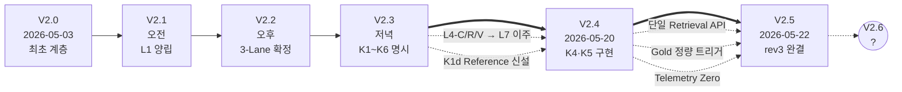
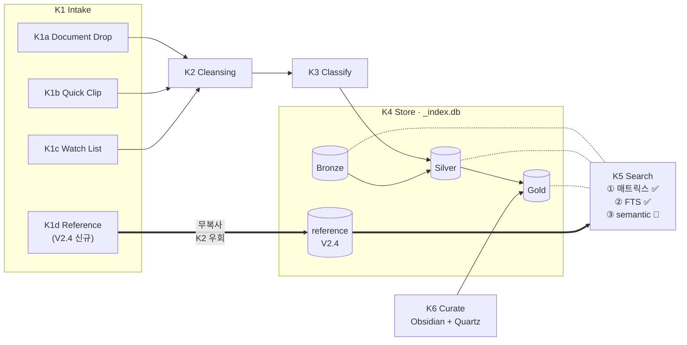

# IRIS 아키텍처 버전 이력

V2.x 계층구조 사양 문서의 시간순 보관소. 원본은 [/Users/iris/Documents/0Dev/](../../../../) 루트에 드롭되고, 여기에는 큐레이션된 사본을 둔다.

## 버전 목록 (역순)

| 버전 | 날짜 | 핵심 변화 | 파일 |
|---|---|---|---|
| **V2.5** | 2026-05-22 | 단일 통합 Retrieval 엔드포인트, Gold 정량 트리거(A/B/C), L6-D1 Fallback, `X-IRIS-Caller` 헤더, Telemetry Zero + 위장 Fallback 알람, V2.5 완료 기준 4지표 | [[V2.5_2026-05-22]] |
| **V2.4** | 2026-05-20 | K4 스키마·K5 API 1차 구현, K1d Reference Lane 신설, Quartz 좌정 | [[V2.4_2026-05-20]] |
| **V2.3** | 2026-05-15 | K1~K6 sub-layer 명시, L7 분리, L6 4분류 | [[V2.3_2026-05-15]] |
| V2.2 | 2026-05-15 (오후) | 3-Lane / Bronze·Silver·Gold / SQLite+FTS5+vec 확정 | 별도 파일 없음 (V2.3 변경표 참조) |
| V2.1 | 2026-05-15 (오전) | L1 양립(webui+claw), L3 코드 완료 | 별도 파일 없음 |
| V2.0 | 2026-05-03 | 최초 계층 정의 | 별도 파일 없음 |

V2.0~V2.2는 독립 파일로 보존되어 있지 않다 — V2.3 본문의 변경표가 사실상의 차분 기록.

## 진화 흐름

## V2.4 시점 L4-K 내부 lifecycle

> 위 두 다이어그램은 Mermaid로 작성됨. Obsidian에서 그래프뷰와 별도로 직접 렌더, Quartz 발행 시도 동일.

## 관리 원칙

- **불변 스냅샷**: 한 번 wiki에 올라간 버전은 수정하지 않는다. 오류 정정도 새 버전(예: V2.4.1)으로.
- **변경표 우선**: 각 버전 문서 상단에 직전 버전 대비 변경표를 둔다. V2.3·V2.4 모두 동일 패턴.
- **이월 항목 추적**: "다음 단계" 절에서 미완료된 항목은 다음 버전에서 🟡/🔴로 이월 표시.

## 관련

- [[index|wiki index]] — Gold vault 진입점
- 무게중심: L4-K Knowledge Center (`iris-system/`)
