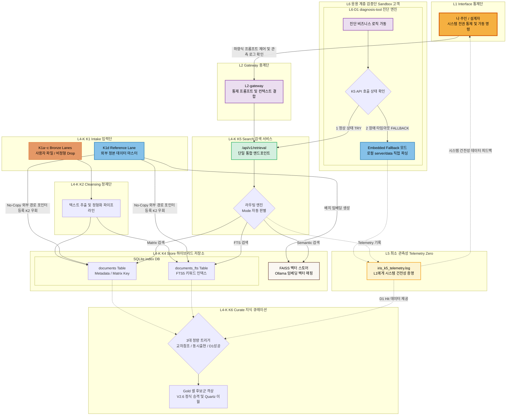

```mermaid
graph TD
    %% 스타일 정의
    classDef owner fill:#f5b041,stroke:#d35400,stroke-width:3px,color:#000;
    classDef bronze fill:#e59866,stroke:#d35400,stroke-width:1px,color:#000;
    classDef reference fill:#85c1e9,stroke:#2980b9,stroke-width:2px,color:#000;
    classDef store fill:#faf7f2,stroke:#795548,stroke-width:2px,color:#000;
    classDef search fill:#d4efdf,stroke:#27ae60,stroke-width:2px,color:#000;
    classDef app fill:#ebdef0,stroke:#8e44ad,stroke-width:2px,color:#000;
    classDef observer fill:#fcf3cf,stroke:#f39c12,stroke-width:2px,color:#000;

    %% L1 레이어
    subgraph L1_Interface ["L1 Interface 통제단"]
        Owner["나 주인 / 설계자<br/>시스템 전권 통제 및 가동 명령"]:::owner
    end

    %% L2 게이트웨이
    subgraph L2_Gateway ["L2 Gateway 중계단"]
        L2_Gate["L2-gateway<br/>통제 프롬프트 및 컨텍스트 결합"]:::app
    end

    %% K1 Intake 레이어
    subgraph K1_Intake ["L4-K K1 Intake 입력단"]
        K1a["K1a~c Bronze Lanes<br/>사용자 파일 / 비정형 Drop"]:::bronze
        K1d["K1d Reference Lane<br/>외부 정본 데이터 마스터"]:::reference
    end

    %% K2 Cleansing 레이어
    subgraph K2_Cleansing ["L4-K K2 Cleansing 정제단"]
        K2_Proc["텍스트 추출 및 정형화 파이프라인"]
    end

    %% K4 Store 레이어
    subgraph K4_Store ["L4-K K4 Store 하이브리드 저장소"]
        subgraph SQLite_DB ["SQLite index DB"]
            M_Table["documents Table<br/>Metadata / Matrix Key"]
            FTS_Table["documents_fts Table<br/>FTS5 키워드 인덱스"]
        end
        FAISS_DB["FAISS 벡터 스토어<br/>Ollama 임베딩 벡터 매핑"]:::store
    end

    %% K5 Search 레이어
    subgraph K5_Search ["L4-K K5 Search 검색 서비스"]
        K5_API["/api/v1/retrieval<br/>단일 통합 엔드포인트"]:::search
        Router{"라우팅 엔진<br/>Mode 자동 판별"}
    end

    %% L5 Observability 레이어
    subgraph L5_Obs ["L5 최소 관측성 Telemetry Zero"]
        Log_File["iris_k5_telemetry.log<br/>L1에게 시스템 건전성 증명"]:::observer
    end

    %% K6 Curate 레이어
    subgraph K6_Curate ["L4-K K6 Curate 지식 큐레이션"]
        Trigger{"3대 정량 트리거<br/>교차참조 / 동시출현 / D1성공"}
        Gold_Candidate["Gold 셀 후보군 격상<br/>V2.6 정식 승격 및 Quartz 이월"]
    end

    %% L6 응용 계층
    subgraph L6_Apps ["L6 응용 계층 검증단 Sandbox 고객"]
        subgraph L6_D1_Component ["L6-D1 diagnosis-tool 진단 엔진"]
            D1_Logic["진단 비즈니스 로직 가동"]:::app
            Fallback_Check{"K5 API 호출 상태 확인"}
            Legacy_Parser["Embedded Fallback 모드<br/>로컬 server/data 직접 파싱"]:::reference
        end
    end

    %% 하향식 통제선
    Owner -- "하향식 프롬프트 제어 및 관측 로그 확인" --> L2_Gate
    L2_Gate --> K5_API

    %% 데이터 적재 흐름
    K1a --> K2_Proc
    K2_Proc --> M_Table
    K2_Proc --> FTS_Table

    K1d -- "No-Copy 외부 경로 포인터 등록 K2 우회" --> M_Table
    K1d -- "No-Copy 외부 경로 포인터 등록 K2 우회" --> FTS_Table
    K1d -- "배치 임베딩 생성" --> FAISS_DB

    %% L6 검증 루프
    D1_Logic --> Fallback_Check
    Fallback_Check -- "1 정상 상태 TRY" --> K5_API
    Fallback_Check -- "2 장애 타임아웃 FALLBACK" --> Legacy_Parser
    Legacy_Parser -.-> Log_File

    %% 검색 라우팅
    K5_API --> Router
    Router -- "Matrix 검색" --> M_Table
    Router -- "FTS 검색" --> FTS_Table
    Router -- "Semantic 검색" --> FAISS_DB

    %% 관측 데이터 피드백선
    Router -. "Telemetry 기록" .-> Log_File
    Log_File -. "시스템 건전성 데이터 피드백" .-> Owner

    %% Gold 셀 트리거 연결
    M_Table -.-> Trigger
    FTS_Table -.-> Trigger
    Log_File -. "D1 Hit 데이터 제공" .-> Trigger
    Trigger --> Gold_Candidate
```